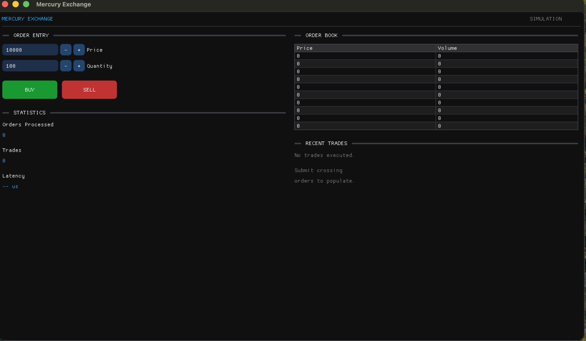
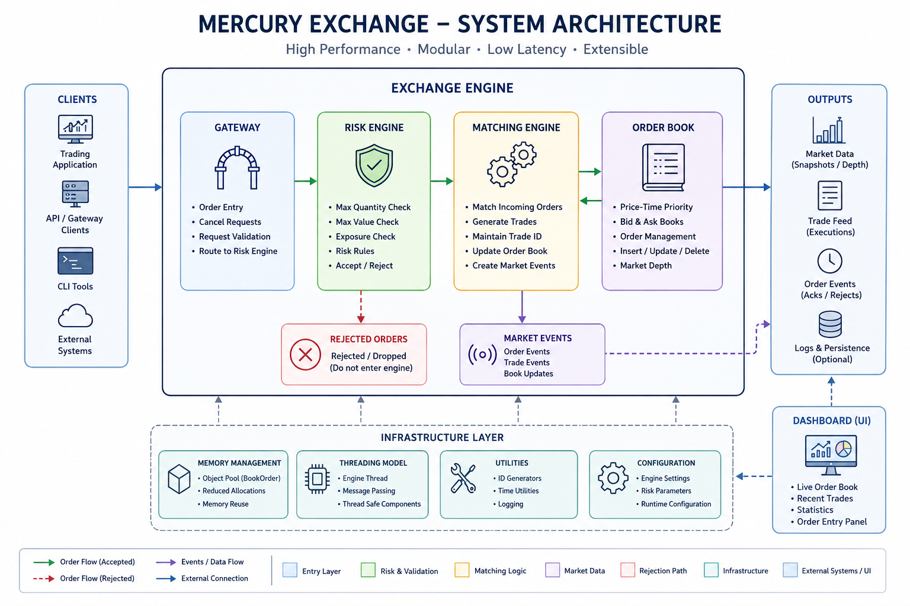

# Mercury Exchange

> A high-performance C++20 limit order book and exchange engine implementing price-time priority matching, pre-trade risk validation, object-pool memory management, multithreaded architecture, and a Dear ImGui-based visualization dashboard.

---

## Overview

Mercury Exchange is a lightweight electronic exchange simulator written entirely in modern C++20. The project focuses on designing the core components found inside real-world financial exchanges while emphasizing performance, modularity, and maintainability.

Unlike toy implementations that only demonstrate order matching, Mercury models an end-to-end execution pipeline where every incoming order flows through multiple subsystems before reaching the order book.

The project was developed to explore low-latency systems programming, concurrent software architecture, efficient memory management, and exchange design principles.

---

## Features

### Core Exchange Engine

- Price-Time Priority (FIFO) Matching Engine
- Limit Order Book
- Order Cancellation
- Market Snapshot Generation
- Trade Generation
- Sequential Trade ID Allocation

### Risk Management

- Maximum Order Quantity Validation
- Maximum Order Value Validation
- Exposure Checks
- Early Order Rejection

### Performance

- Object Pool based memory allocation
- Minimal heap allocations
- Cache-friendly data structures
- O(log N) price level lookup
- Constant-time order cancellation through indexed lookup

### Architecture

- Modular C++20 design
- Gateway driven execution pipeline
- Thread-safe engine execution model
- Separation of UI and business logic
- Unit-tested core components

### Visualization

- Dear ImGui dashboard
- Live order book visualization
- Order entry panel
- Statistics panel
- Recent trade window

---

# System Architecture

```

```
                    Incoming Orders
                           │
                           ▼
                    +---------------+
                    |    Gateway    |
                    +---------------+
                           │
                           ▼
                    +---------------+
                    |  Risk Engine  |
                    +---------------+
                           │
               Accepted    │    Rejected
                           ▼
                    +---------------+
                    |Matching Engine|
                    +---------------+
                           │
                           ▼
                    +---------------+
                    |  Order Book   |
                    +---------------+
                           │
          +----------------+----------------+
          │                                 │
          ▼                                 ▼
     Market Snapshot                  Trade Generation
          │                                 │
          └───────────────┬─────────────────┘
                          ▼
                  Dear ImGui Dashboard
```

````

---

## Project Structure

```text
Mercury Exchange

├── app/
│   ├── application.cpp
│   └── main.cpp
│
├── benchmark/
│   └── benchmark.cpp
│
├── core/
│   ├── config/
│   └── types/
│
├── exchange/
│   ├── gateway/
│   ├── matching/
│   ├── orderbook/
│   ├── risk/
│   └── events/
│
├── infrastructure/
│   ├── memory/
│   └── threading/
│
├── tests/
│
└── ui/
    └── dashboard.cpp
```

---

## Exchange Pipeline

Every order submitted to Mercury follows the execution pipeline below.

```
Client

↓

Gateway

↓

Risk Validation

↓

Matching Engine

↓

Order Book

↓

Trade Generation

↓

Market Snapshot

↓

GUI / Benchmark / Tests
```

The Gateway acts as the only public entry point into the exchange, ensuring that every order is validated before reaching the matching engine.

---

## Key Components

### Gateway

The Gateway coordinates the complete order lifecycle.

Responsibilities:

* Receives incoming orders
* Performs risk validation
* Rejects invalid orders
* Forwards accepted orders to the matching engine

---

### Risk Engine

The Risk Engine performs lightweight pre-trade checks including:

* Maximum quantity limits
* Maximum order value
* Exposure validation

Orders failing validation are rejected before consuming matching engine resources.

---

### Matching Engine

The Matching Engine coordinates execution while maintaining globally unique trade identifiers.

Responsibilities include:

* Matching incoming orders
* Trade generation
* Delegating order management to the order book
* Market snapshot creation

---

### Order Book

The Order Book implements strict Price-Time Priority.

Features include:

* Separate bid and ask books
* FIFO ordering within each price level
* Constant-time order lookup
* Efficient cancellation
* Market depth generation


## Building

### Requirements

* C++20 compatible compiler
* CMake ≥ 3.20
* Git

Mercury automatically downloads its third-party dependencies using CMake FetchContent.

### Clone the repository

```bash
git clone https://github.com/<your-username>/mercury-exchange.git

cd mercury-exchange
```

### Build

```bash
cmake -B build

cmake --build build
```

---

## Running the Application

Launch the graphical dashboard using

```bash
./build/mercury_exchange
```

The application opens a Dear ImGui based dashboard containing:

* Order Entry
* Order Book
* Statistics
* Recent Trades

The dashboard communicates with the exchange through the Gateway without directly interacting with the matching engine, maintaining a clean separation between presentation and business logic.

---

## Running Unit Tests

Mercury currently includes unit tests covering all major exchange components.

Execute

```bash
ctest --test-dir build --output-on-failure
```

or

```bash
./build/tests/mercury_tests
```

Current coverage includes

* Order Book
* Matching Engine
* Gateway
* Risk Engine

All 20 tests currently pass.

---

## Running the Benchmark

Mercury includes a standalone benchmarking executable for measuring exchange throughput.

Run

```bash
./build/mercury_benchmark
```

Example output

```text
=============================================
        Mercury Exchange Benchmark
=============================================

Orders Submitted : 1000000
Orders Accepted  : 814736
Orders Rejected  : 185264
Trades Executed  : 710879

Elapsed Time     : 0.221 s
Throughput       : 4.52 M Orders/s
Average Latency  : 221 ns/order

=============================================
```

---

## Benchmark Configuration

The benchmark uses

* 1,000,000 synthetic limit orders
* Fixed random seed for reproducibility
* Uniformly distributed prices
* Random buy/sell order generation
* Random order quantities
* Release build (`-O3`)
* Single-threaded execution

The benchmark measures the end-to-end order submission pipeline including

* Gateway
* Risk Engine
* Matching Engine
* Order Book

The reported throughput reflects the complete processing path rather than isolated matching performance.

> **Note:** Benchmark results depend on CPU architecture, compiler, optimization flags, operating system, and workload characteristics. The numbers above were obtained on an Apple Silicon machine using Clang in Release mode and should be interpreted as a reference measurement rather than a universal performance claim.

---

## Screenshots

### Dashboard

<p align="center">

</p>

---

### Architecture

<p align="center">

</p>

---

## Design Decisions

### Price-Time Priority

Mercury follows the same matching rule employed by most modern electronic exchanges.

Orders are matched

1. Best Price
2. Earliest Arrival Time

This guarantees deterministic and fair execution.

---

### Memory Management

Instead of allocating memory for every incoming order, Mercury employs an object pool to recycle `BookOrder` instances.

Benefits include

* Reduced heap allocations
* Predictable memory usage
* Lower allocation latency
* Better cache locality

---

### Modularity

Each subsystem has a clearly defined responsibility.

| Component       | Responsibility                      |
| --------------- | ----------------------------------- |
| Gateway         | Entry point for all incoming orders |
| Risk Engine     | Pre-trade validation                |
| Matching Engine | Coordinates execution               |
| Order Book      | Maintains market state              |
| Dashboard       | Visualization only                  |
| Benchmark       | Performance evaluation              |
| Tests           | Functional verification             |


# Performance Analysis

Mercury was designed with low-latency systems programming principles in mind. Although it is an educational project rather than a production exchange, many implementation decisions mirror techniques employed in modern electronic trading systems.

Performance-oriented design choices include:

* Object pool allocation for resting orders
* Constant-time order lookup using an indexed registry
* Cache-friendly data structures
* Minimal dynamic memory allocation during execution
* Strict separation between validation and matching
* Fixed-size containers where practical
* Release-mode compilation (`-O3`)

The benchmark demonstrates that the engine is capable of processing millions of synthetic limit orders per second while maintaining sub-microsecond average processing latency on commodity hardware.

---

# Testing

The exchange engine is validated through unit tests covering all major subsystems.

Current test suites include:

* Order Book
* Matching Engine
* Gateway
* Risk Engine

Tests verify:

* Correct order insertion
* Price-time priority matching
* Trade generation
* Order cancellation
* Risk validation
* Market snapshot generation
* Rejection paths

The project currently contains **20 passing unit tests**.

---

# Technologies Used

### Language

* C++20

### Build System

* CMake

### GUI

* Dear ImGui
* GLFW

### Testing

* GoogleTest

### Concurrency

* C++ Standard Library Threads

### Development Environment

* Apple Clang
* Git
* GitHub

---

# Future Improvements

The current implementation focuses on the core exchange pipeline. Several extensions could make the simulator even more realistic.

### Exchange Features

* Market Orders
* Stop Orders
* Fill-or-Kill (FOK)
* Immediate-or-Cancel (IOC)
* Good-Till-Cancelled (GTC)
* Post-Only Orders

### Performance

* Lock-free order queues
* NUMA-aware memory allocation
* SIMD optimizations
* Custom allocator
* Multi-symbol matching
* Multi-core execution pipeline

### Networking

* TCP/FIX gateway
* Binary market data feed
* Order replay engine
* Historical data playback

### Persistence

* Trade logging
* Order journal
* Snapshot serialization
* Recovery after restart

### Visualization

* Live trade tape
* Candlestick charts
* Throughput graphs
* Latency histograms
* Market depth heatmap

---

# Learning Outcomes

Building Mercury Exchange provided practical experience with:

* Modern C++20 programming
* Systems software architecture
* Concurrent programming
* Memory management
* Performance optimization
* Electronic exchange design
* Low-latency software engineering
* Unit testing
* GUI development with Dear ImGui

---

# Repository Highlights

* Modern C++20 codebase
* Modular architecture
* Clear separation of concerns
* Comprehensive inline documentation
* Unit-tested exchange engine
* Interactive GUI dashboard
* Performance benchmark
* Easy-to-build CMake project

---

# Contributing

Contributions are welcome.

If you discover a bug, identify a performance improvement, or would like to implement additional exchange functionality, feel free to open an issue or submit a pull request.

---

# License

This project is released under the MIT License.

See the `LICENSE` file for details.

---

# Acknowledgements

This project was inspired by the architecture of modern electronic exchanges and the design principles used in low-latency trading systems. It also draws on ideas from open-source C++ systems programming projects and the Dear ImGui ecosystem for rapid visualization.

